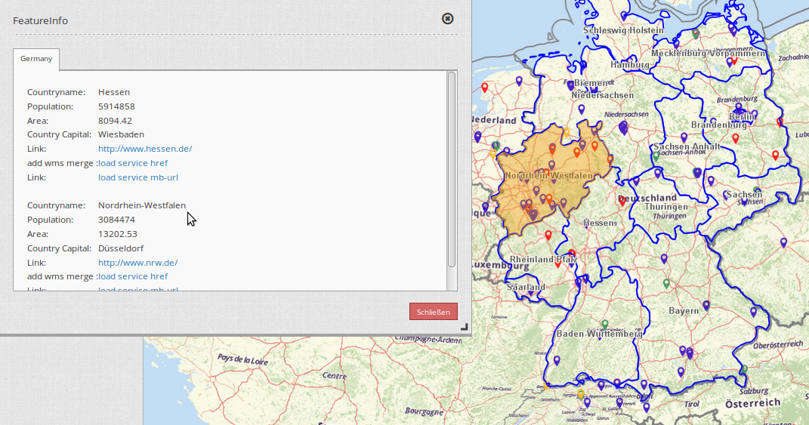
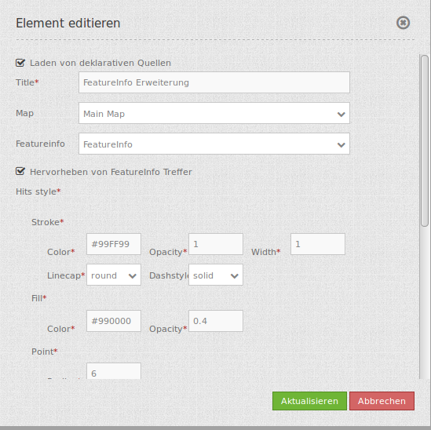

.. _feature_info_extension:

Feature Info Erweiterung 
***********************

Dieses Element stellt eine Erweiterung für die Infoabfrage bereit, die mit WMS Services funktioniert.
Die Erweiterung ermöglicht eine farbliche Hervorhebung einer abgefragten Geometrie durch das Bewegen des Mauszeigers auf die vorher definierte Fläche. 

Durch das Starten der Infoabfrage über einen Mausklick auf der Karte öffnet sich das Dialogfenster und die abgefragte Fläche wird auf der Karte gelb markiert. Wenn nun der Mauszeiger auf die markierte Fläche kommt, so färbt sich diese dunkelblau und wird hervorgehoben. 

Konfiguration
=============

Für die Konfiguration der Erweiterung ist das FeatureInfo-Element die Vorraussetzung. Mehr zu diesem Thema finden Sie unter http://doc.mapbender3.org/de/bundles/Mapbender/CoreBundle/elements/feature_info.html

* **Laden von delarativen Quellen:** 
* **Hervorheben von FeatureInfo Treffern:** Farbliches Hervorheben der Treffer auf dem Kartenausschnitt bei einer Informationsabfrage.
* **Title:** Titel des Elements. Dieser wird in der Layouts Liste angezeigt und ermöglicht, mehrere Elemente voneinander zu unterscheiden.
* **Map:** ID des Kartenelements, auf das sich das Element bezieht.
* **Featureinfo:** FeatureInfo-Element, auf das sich die Erweiterung bezieht. 

YAML-Definition:
----

.. code-block:: yaml

   tooltip: 'Feature Info Extension'  # Text des Tooltips
   map: ~	                          # ID des Kartenelements
   featureinfo: ~ 	                  # ID des FeatureInfo-Elements
   highlight_source: true             # aktiviert die farblich Hervorhebung der Treffer. Standardwert ist true. 
   load_declarative_wms: true         # Laden von deklarativen Quellen. Standardwert ist true.

Für das Element wird das FeatureInfo-Element benötigt. Zu der Konfiguration der Infoabfrage besuchen sie die Dokumentationsseite unter :doc:`feature_info`.

Class, Widget & Style
============================

* **Class:** Mapbender\\CoreBundle\\Element\\FeatureInfoExt
* **Widget:** mapbender.element.featureInfoext.js
* **Style:** mapbender.elements.css

HTTP Callbacks
==============

Keine.

JavaScript API
==============

activate
--------

Aktiviert das Modul, welches dann auf einen Mausklick wartet, um die Infoabfrage zu öffnen und die Erweiterung zu starten.

deactivate
----------
Deaktiviert das Modul.

JavaScript Signals
==================

Keine.
