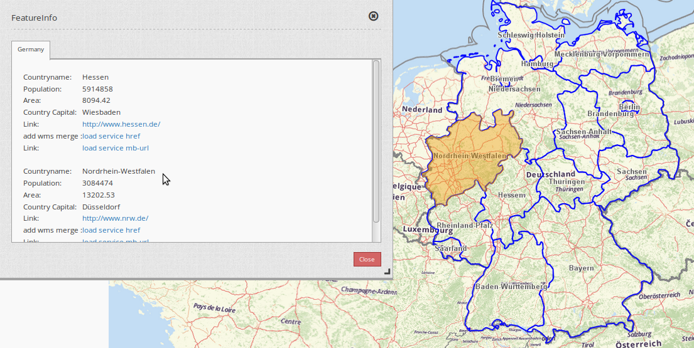
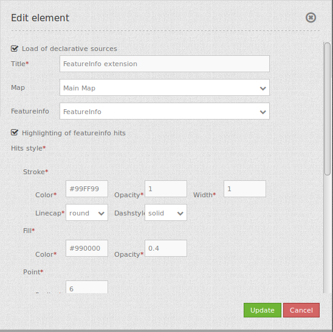

.. _feature_info_extension:

Feature Info Extension
***********************

This element provides an extension for the featureInfo. At the moment two special behaviours can be handled:

* allow highlight of the geometies of the result of the featureInfo
* allow add WMS Services from featureInfo 

You can allow highlight of the geometies of the result of the featureinfo. You can define two colors - color for the hits, color for the object with focus. This functionality is supported for points, lines and areas. The highlighted objects are printed. Please note that you have to modify your featureinfo-template. Read more about this at **How to highlight the geometry**.

You can allow add WMS Services by adding a link to your FeatureInfo. Please note that you have to modify your featureinfo-template. read more about this at **How to add a WMS by defining a link**.

Configuration
=============

You need the feature info element to refer to.

* **Load of declarative sources:**  allow to load service from a link (for example from featureInfo or search) and define the layers to activated, default false. 
* **Highlighting of featureinfo hints:** highlight the featureinfo hint of the requested area.
* **Title:** Title of the element in the layout list.
* **Map:** Id of Map element to query.
* **Featureinfo:** feature info element, which is the subject of the extension.

YAML-Definition:
----

.. code-block:: yaml

   tooltip: 'Feature Info Extension'  # text to use as tooltip.
   map: ~                             # Id of Map element.
   featureinfo: ~                     # Id of featureinfo.
   highlight_source: true             # highlight the requested area/ featureinfo hints, default: true 
   load_declarative_wms: true         # allow to load service from a link (for example from featureInfo or search) 
                                      # and define the layers to activated, default false 

You need a feature info-element to use this extension. 

How to highlight the geometry
==============================

To use this functionality you have to extend your FeatureInfo-Template. It needs a **class="geometryElement"**, data-srid="EPSG:4326" with the information about the projection of the data and **data-geometry** with the WKT presentation of the geometry:

.. code-block:: html

  <table class="geometryElement" data-srid="EPSG:4326" data-geometry="MULTIPOLYGON(...)" >...</table>

If you use PostgreSQL as datasource in your WMS Service, you can use the PostGIS function st_asText(geom) to generate the WKT.

How to add a WMS by defining a link
====================================

You can add a WMS to Mapbender by defining a link f.e. in your WMS featureinfo or your search results.

Set **useDeclarative** true im mapbender.yml or check declarative in administration.

The link has to look like this:

.. code-block:: html

  <a mb-action="source.add.wms" mb-layer-merge="1" mb-wms-merge="1" 
  mb-wms-layers="Gewaesser,Fluesse" 
  href="http://wms.wheregroup.com/cgi-bin/germany.xml?VERSION=1.1.1&REQUEST=GetCapabilities&SERVICE=WMS">load service</a>

  <a mb-action="source.add.wms" mb-layer-merge="1" mb-wms-merge="1" 
  mb-wms-layers="Gewaesser,Fluesse" 
  mb-url="http://wms.wheregroup.com/cgi-bin/germany.xml?VERSION=1.1.1&REQUEST=GetCapabilities&SERVICE=WMS" href="">load service</a>

.. code-block:: yaml

    mb-action="source.add.wms"    # defines action to add a  WMS
    mb-wms-merge="1"              # adds the WMS only once, if WMS is already part of the application it will use the WMS which is there (default is 1)
    mb-layer-merge="1"            # default is 1 which means: activate the layers passed mb-wms-layers and do not disable the layers which are already active.
    mb-wms-layers="Gewaesser,Fluesse" # defines the layers to be activated, _all activates all layers, default all layers are deactivated
    href oder mb-url              # refer to the WMS getcapabilities URL

   

Class, Widget & Style
============================

* **Class:** Mapbender\\CoreBundle\\Element\\FeatureInfoExt
* **Widget:** mapbender.element.featureInfoext.js
* **Style:** mapbender.elements.css

HTTP Callbacks
==============

None.

JavaScript API
==============

activate
--------

deactivate
----------
Deactivates the widget.

JavaScript Signals
==================

None.
